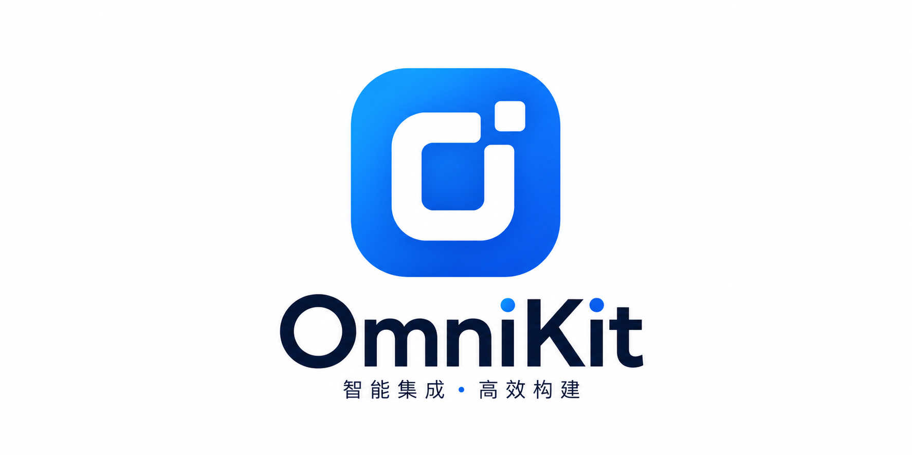
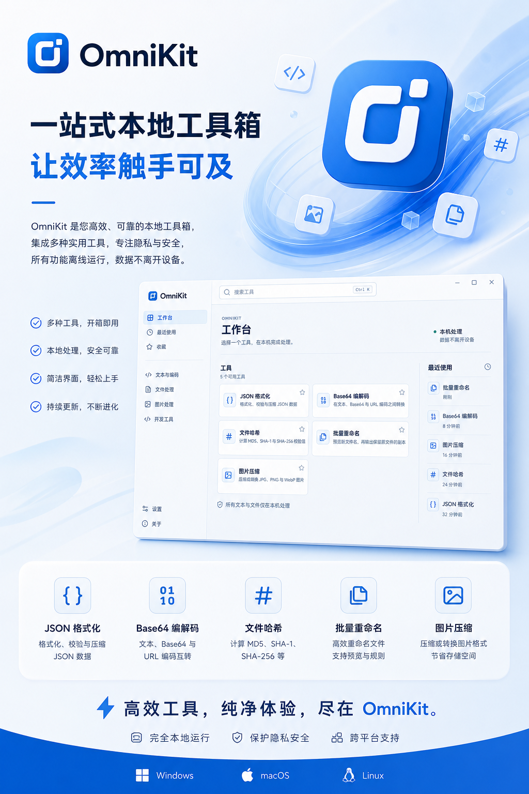

  

  # ✨ OmniKit

  **🧰 一站式桌面工具箱，让常用处理更简单。**

  文本、文件、图片与教育工具集中在一个干净、轻量的 Windows 应用中。

  当前版本：`v0.1.4`

## ✨ 一个应用，处理日常琐事

OmniKit 将高频的小工具集中在统一工作台中，支持搜索、收藏和最近使用，减少在网页、临时脚本与多个小软件之间反复切换。

常规文本、文件和图片操作在设备本机完成。AI 图片能力只会在用户主动点击开始后，将当前选中的图片发送至用户自行配置的服务。

## 🧩 现有工具

| 分类 | 工具 | 能做什么 |
| --- | --- | --- |
| 💻 开发工具 | JSON 格式化 | 格式化、校验与压缩 JSON 数据 |
| 💻 开发工具 | Base64 编解码 | 在文本、Base64 与 URL 编码之间转换 |
| 📝 文本工具 | 剪贴板历史 | 查找、置顶并再次复制最近记录的文本与链接 |
| 📁 文件工具 | 文件哈希 | 计算 MD5、SHA-1 与 SHA-256 校验值 |
| 📁 文件工具 | 批量重命名 | 先预览新文件名，再输出保留原文件的副本 |
| 🖼️ 图片工具 | 批量图片处理 | 批量压缩、缩放或转换 JPG、PNG 与 WebP 图片 |
| 🖼️ 图片工具 | 裁剪与旋转 | 自由裁剪、按比例取景，并旋转或翻转图片 |
| 🖼️ 图片工具 | 图片加水印 | 添加文字或图片水印，支持九宫格定位与平铺 |
| 🖼️ 图片工具 | 拼接与切图 | 横向或纵向拼接图片，并支持定高与九宫格切图 |
| 🖼️ 图片工具 | 证件照换底色 | 通过 AI 生成白、蓝、红或自定义纯色背景的完整证件照 |
| 🖼️ 图片工具 | 智能抠图 | 通过 AI 提取主体并输出透明背景 PNG |
| 🖼️ 图片工具 | 老照片修复 | 保守修复划痕、灰尘、褪色和轻微模糊，不强制上色 |
| 🖼️ 图片工具 | 图片放大增强 | 通过 AI 超分辨率将图片放大 2 倍或 4 倍 |
| 🖼️ 图片工具 | 截图识字 | 识别截图或本地图片中的中文、英文文字 |
| 🎓 教育工具 | 手写字帖生成 | 输入汉字，生成可打印的田字格或米字格字帖 |
| 🎓 教育工具 | 字数计算 | 统计文本总字数、汉字、英文单词与字符 |
| 🎓 教育工具 | AI 去手写 | 使用配置的 AI 服务清理试卷或图片中的手写批注 |

## 🤖 AI 图片能力

在“设置 > AI 服务”中只需配置一套连接信息：

- 🔗 完整的图像编辑 API 地址，例如 `https://example.com/v1/images/edits`
- 🧠 模型名称
- 🔑 API 密钥；密钥仅保存在 Windows 凭据管理器中

证件照换底色、智能抠图、老照片修复和图片放大增强共用这套配置，但每个工具都会独立发起请求、生成预览并保存结果，不会读取或复用其他工具的处理结果。

所有 AI 图片结果都会先进入临时预览；确认后再另存为新文件，原图不会被覆盖。AI 服务可能产生费用或误改图片，请根据所用服务的规则检查结果。

## 🔒 数据处理边界

- JSON、Base64、剪贴板、哈希、重命名和常规图片处理均在本机执行。
- 截图识字使用 Windows 本地 OCR 能力。
- 只有 AI 图片工具会在用户主动操作后访问已配置的第三方服务。
- OmniKit 不内置公共 AI 密钥，也不会自动替用户发起 AI 请求。

## 🎯 为日常使用而设计

- 🔒 **本地优先**：常用处理在桌面端完成，数据留在自己的设备中。
- 🧭 **统一工作台**：分类、搜索、收藏与最近使用集中在一处。
- ⚡ **轻量直接**：不堆叠复杂设置，打开工具即可开始处理。
- 🔄 **持续更新**：应用可从 GitHub Releases 获取新版本与在线更新。

  高效工具，纯净体验，尽在 OmniKit。

